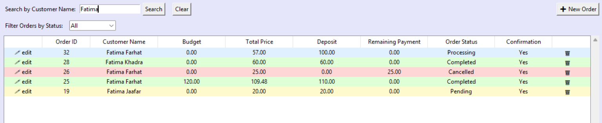
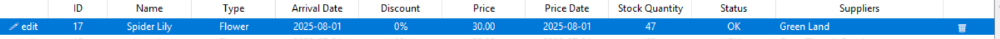

# Hera FlowerShop Management System

A desktop-based Flower Shop Management System built using **Python** and **Tkinter**, with a **MySQL** backend.

This application allows flower shop staff to manage customers, items, suppliers, and orders through a clean and easy-to-use GUI. It's designed to simplify order processing, item tracking, and customer management in small retail environments.

## Features

- **Customer Management**  
  - Update, and search for customers with phone number and name
  - Customers are added to the system after they place an order

- **Item Management**  
  - View all available items with real-time display of price, discount, and ID
  - Show stock status of items for stock management

- **Order Placement & Management**  
  - Select multiple items with quantity and discount
  - Navigate through the order process using Back and Next buttons
  - Remove items before finalizing an order
  - Adjust stock and loyalty points of customers after each order accordingly

- **Order History**  
  Track order history of a customers and their statuses (including Cancelled orders).

- **Supplier Management**  
  Add, update, and search for supplier information.

- **Search & Filter**  
  Every section supports easy searching and order status filtering for efficiency.

- **Persistent Data with MySQL**  
  All data is stored in a connected MySQL database.

## Technologies Used

- **Python 3**
- **Tkinter** – GUI library
- **MySQL** – Database backend
- **MySQL Connector/Python** – for Python–MySQL interaction

## Screenshots

Here are some snapshots of the FlowerShop Management System in action:

- Main Dashboard
    
  

- Items View
    
  

- Add Item
    
  

- Search Item
    
    

- Edit Item
    
    

- Delete Item
    
    

- Suppliers View
    
    

- Add Supplier
    
    
  
- Search Supplier
    
    

- Edit Supplier
    
    

- Delete Supplier
    
    

- Supplier Added to the Item

   

- Orders

   

- Search Orders

   

- Filter Orders

   

- Place new Order

  **Step 1**

   

  **Step 2**

   

  **Step 3**

   

- Order Details

   

- Edit Order

   

- Items Stock Adjustment After Order Placement 

   

- Customer Loyalty Points Adjustment After Order Placement 

   

- Delete Order

   

- Customers

   

- Customers Order History

   

- This Month's Customers

   

- New Customers This Month

   

- Edit Customer

   

- Delete Customer

   

  
  

  

